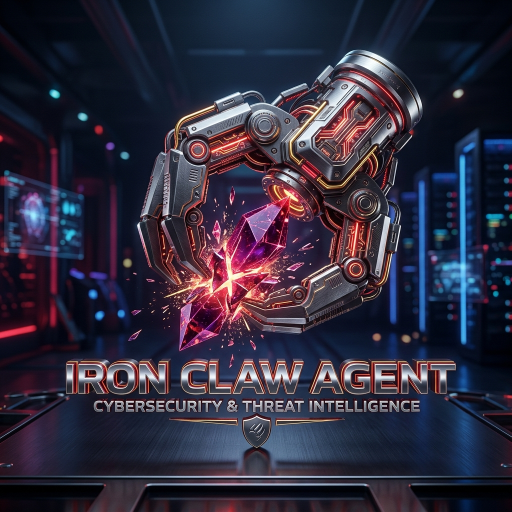
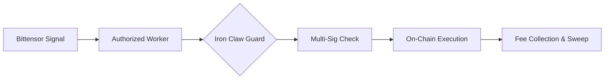

<div align="center">
  

  # 🛡️ Iron Claw Agent — Autonomous On-Chain Executor

  [](https://github.com/raulrllor083-ship-it/iron-claw-agent)
  [](https://github.com/raulrllor083-ship-it/iron-claw-agent)
  [](https://near.org)

  **"The physical guard of the digital vanguard."**

  *A hardened, multi-signature protected execution layer for autonomous De-Fi agents on the NEAR Protocol.*
</div>

---

## 💎 Elite Metadata

| Attribute | Value |
| :--- | :--- |
| **Brand** | Deep Velvet |
| **Intelligence** | Bittensor Subnet 8 |
| **Security** | Iron Claw Multi-Sig / Ledger Vault |
| **Intent Layer** | Confidential Intents Enabled |

---

## 🏛️ System Architecture

The Iron Claw Agent serves as the high-security bridge between AI-driven intelligence (Bittensor) and the physical execution of trades on the NEAR Mainnet.



## 🛠️ Main Components

### 1. **Authorized TEE Worker**
Supports secure signing from Trusted Execution Environments (TEE) or Multi-Party Computation (MPC) workers using the `authorized_worker` public key.

### 2. **Never-Loss Guard (Physical)**
Implements on-chain "Physical Never-Loss" verification. If a trade outcome does not meet the `min_profit_margin_bps` specified in the risk configuration, the circuit breaker halts execution.

### 3. **Confidential Intents**
V3.1-bluedragon introduces the **Intent Layer**, allowing external Native/EVM agents to route trades through the hub as Flash Liquidity, paying a solver fee that feeds the compounding pool.

---

## 🚀 Deployment

### Build
```bash
cargo build --target wasm32-unknown-unknown --release
```

### Initialize
```bash
near contract call <agent-id> new \
  '{"owner_id": "owner.near", "ledger_contract": "ledger.near"}' \
  --accountId <agent-id>
```

---

## ⚖️ License
**Elite Production Grade** — Proprietary logic for the Blue Dragon Ecosystem.
Standard MIT License applies to the repository structure.

---
<p align="center">
  Part of the <strong>Blue Dragon Ecosystem</strong>
</p>
